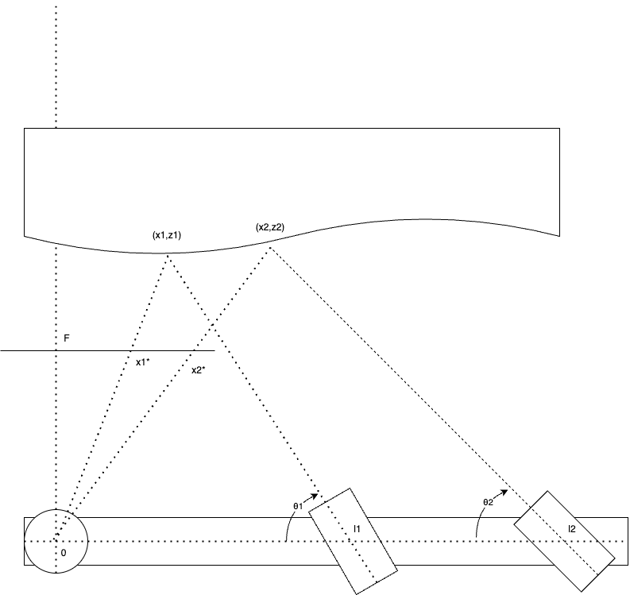
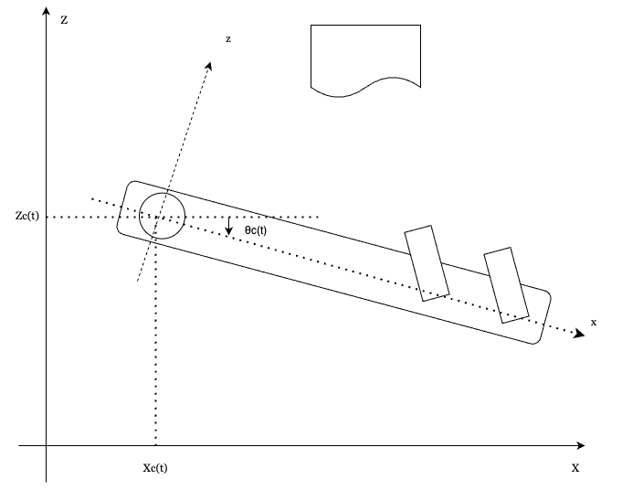

# 設定

## プラットフォーム設定

カメラ座標系を $(x,z)$ とする．

- カメラ: $x=0$, 光軸:$\frac{\pi}{2}$, 焦点距離:$y=F$
- スリット1:$x=r_1$, 光軸:$\theta_1$
- スリット2:$x=r_2$, 光軸:$\theta_2$
とする．

### 三角測量

$y=F$にあるカメラ画像上で，
スリット1のスリットが$x=x^{\prime}_1$に観測されたとき，

三角測量は，
- カメラの仰角 $\theta_0=\arctan\frac{F}{x^{\prime}_1}$
- スリットの仰角 $\theta_1$
- カメラとスリットの間隔 $r_1$

から，
- 対象物の距離 $z = \frac{\sin\theta_0 \sin\theta_1}{\sin(\theta_0+\theta_1)}r_1$

を求められる，というもの

$$
\begin{cases}
\tan\theta_1 &= \frac{r_1-x_1}{z_1}\\
\frac{x_1^{\prime}}{F} &= \frac{x}{z}
\end{cases}
$$
より，
$$
\begin{align}
\begin{bmatrix}
x_1\\
z_1
\end{bmatrix} = \frac{r_1\tan\theta_1}{x^{\prime}_1\tan\theta_1+F}\begin{bmatrix}
x^{\prime}_1\\
F
\end{bmatrix}
\end{align}
$$

## ワールド座標系 $(X,Y)$

- 移動しない対象物 $f : Z=f(X)$
- 移動するプラットフォーム（カメラ，2スリット光）
  - カメラ $\pmb{X_c}=(X_c(t), Z_c(t))$
  - プラットフォームの回転角 $\theta_c(t)$
がある．

したがって，カメラ座標系 $\pmb{x}=(x,z)$ との間に

$$
\begin{align}
\pmb{x}(t) &= \pmb{R}_p^{-1}(t) (\pmb{X}-\pmb{X_c}(t))\\
\pmb{R}_p(t) &= \pmb{R}(\theta_c)
\end{align}
$$

